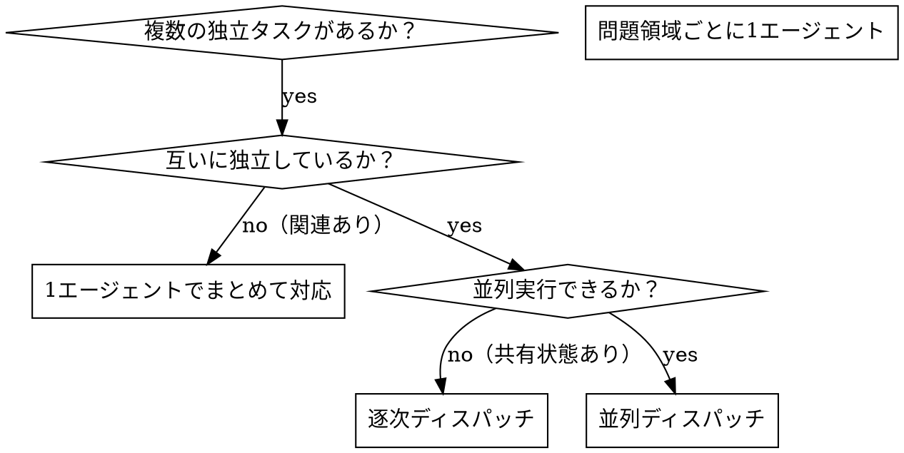

<!--
出典: https://github.com/obra/superpowers/blob/main/skills/dispatching-parallel-agents/SKILL.md
原作者: obra（Jesse Vincent）/ obra/superpowers
ライセンス: MIT（https://github.com/obra/superpowers/blob/main/LICENSE ／確認: 2026-07-02）
取得方法: WebFetch（raw.githubusercontent.com）で原文を取得済み。

本ファイルは原文の章立て（When to Use / The Pattern / Agent Prompt Structure /
Common Mistakes / When NOT to Use / Verification）を踏襲しつつ本文を日本語化し、
本リポ（6 チャネル EC 横断商品検索）向けの具体例・参照ファイルを追加したもの。
原文の逐語コピーではない。
-->

# 並列エージェントディスパッチ（Dispatching Parallel Agents）

## 概要

独立したコンテキストを持つ専用サブエージェントにタスクを委譲する手順スキル。
指示とコンテキストを丁寧に設計することで、サブエージェントは焦点を絞ったまま
タスクに集中し成功しやすくなる。サブエージェントはオーケストレーター（親エージェント）
のセッション履歴を一切引き継がない — 必要な情報だけを親が構成して渡す。これにより
オーケストレーター自身のコンテキストも節約できる。

複数の無関係な作業（異なるチャネル、異なる検証対象、異なる調査領域）を順次処理すると
時間を浪費する。それぞれが独立しているなら並列で進められる。

**核心原則:** 独立した問題領域ごとに 1 エージェントをディスパッチし、同時に働かせる。

## 使うべき場面



**使うべき場面:**
- 3 件以上のチャネル・領域を独立に調査する必要がある（例: 6 チャネル scout）
- 複数のサブシステム／ドキュメントが互いに影響せず壊れている、または検証が必要
- 各問題が他の文脈を読まなくても理解できる
- 調査・検証の間に共有状態（同じファイルの同時編集等）がない

**使うべきでない場面:**
- 各失敗・課題が相互に関連している（1 つ直すと他も直る可能性がある）
- システム全体の状態理解が必要
- どこが壊れているかまだ分かっていない探索的デバッグの段階
- エージェント同士が同じファイル・同じリソースを取り合う

## 手順（The Pattern）

### 1. 独立した領域を特定する

何が独立しているかで問題をグループ化する。本リポの典型例は「チャネル」である。
amazon-scout の調査は rakuten-scout の調査結果に依存しない。

### 2. 焦点を絞ったタスクを組み立てる

各サブエージェントには以下を与える：
- **具体的なスコープ**: 1 チャネル、または 1 検証対象に限定
- **明確なゴール**: 何を返せば完了か
- **制約**: 他のチャネル・他のファイルには触れない
- **期待する出力形式**: 何を、どの形式で返すか

### 3. 同一応答内で並列ディスパッチする

複数のサブエージェント呼び出しを **同じ応答（1 メッセージ）内** にまとめて発行する — これが
並列実行される。1 メッセージにつき 1 件ずつ発行すると逐次実行になってしまう。

```text
サブエージェント (amazon-scout):            "◯◯ を Amazon で調査"
サブエージェント (rakuten-scout):           "◯◯ を楽天市場で調査"
サブエージェント (yahoo-shopping-scout):     "◯◯ を Yahoo!ショッピングで調査"
サブエージェント (iherb-scout):              "◯◯ を iHerb で調査"
サブエージェント (mercari-scout):            "◯◯ をメルカリで調査"
サブエージェント (osakado-scout):            "◯◯ をオオサカ堂で調査"
# 6 件とも同時に実行される。
```

### 4. レビューと統合

サブエージェントの結果が返ってきたら：
- 各サマリを読む
- 結果同士に矛盾（例: 同じ商品について価格や在庫の食い違い）がないか確認する
- ゲート 1〜3（`docs/rules-search-product.md`）またはゲート 4（`fact-check-reviewer`）で統合検証する
- 全結果を統合して次工程（report-writer 等）に渡す

## エージェントプロンプトの構造

良いディスパッチ指示は次の 3 条件を満たす：
1. **焦点が絞られている** — 明確な 1 つの問題領域
2. **自己完結している** — 問題を理解するために必要な文脈が全て含まれる
3. **出力形式が具体的** — 何を返すべきか明示する

```markdown
◯◯（商品名）を rakuten-scout として調査してください。

1. item.rakuten.co.jp の個別商品ページ形式の URL のみを対象とする
   （search.rakuten.co.jp の検索結果 URL は禁止）
2. 価格・在庫・レビュー件数を一次情報から確認する
3. 見つからない場合は「該当なし」と明記する（推測で埋めない）

返してほしいもの: 商品名 / URL / 価格 / 在庫状況 / 確認日 のプレーンテキスト一覧
```

## よくある間違い

**❌ 範囲が広すぎる:** 「全チャネルまとめて調べて」— エージェントが迷子になる
**✅ 具体的:** 「rakuten-scout として楽天市場だけ調べて」— スコープが絞られている

**❌ 文脈が無い:** 「あの商品を確認して」— どの商品か分からない
**✅ 文脈あり:** 商品名・必須条件・予算をそのまま貼り付ける

**❌ 制約が無い:** サブエージェントが他チャネルの担当領域まで手を出してしまう
**✅ 制約あり:** 「担当チャネル以外の候補は返さない」

**❌ 出力があいまい:** 「調べて」— 何が変わったか分からない
**✅ 具体的:** 「商品名／URL／価格／在庫／確認日のプレーンテキスト一覧を返す」

## 使うべきでない場面（再掲）

- **関連する失敗:** 1 つの根本原因が複数の症状に波及している場合は、まず 1 エージェントで
  まとめて調査する
- **全体像の理解が必要:** システム全体の状態を見ないと判断できない場合
- **探索的デバッグ:** 何が壊れているかまだ分かっていない場合
- **共有状態:** 同じファイル・同じ商品候補リストを複数エージェントが同時に編集する場合

## This Repository（本リポ適用）

本リポでは以下の場面で本スキルを適用する：

1. **6 チャネル scout の並列調査**: `amazon-scout` / `rakuten-scout` /
   `yahoo-shopping-scout` / `iherb-scout` / `mercari-scout` / `osakado-scout` の
   6 サブエージェント（`.claude/agents/*.md`）はチャネルごとに完全に独立した調査を行うため、
   本スキルの対象そのものである。`.claude/commands/search-product.md` フェーズ 2 は
   「順次実行してもよいが並行実行してもよい」としているが、本スキルの手順（同一応答内での
   並列ディスパッチ）を既定の実行方法として使うことで、調査時間を短縮しつつ各チャネルの
   スコープを厳密に分離できる。
2. **観点マトリクス監査（coverage-critic）と独立ファクトチェック（fact-check-reviewer）**:
   両者は目的が異なる独立レビューであり（前者は着手前の網羅性、後者は納品前の事実検証）、
   互いの結果に依存しないため、対象が複数レポート・複数候補にまたがる場合は本スキルに従い
   並列ディスパッチしてよい。ただし `docs/rules-research.md` の想定順序（coverage-critic は
   着手前・fact-check-reviewer は納品前）自体は変更しない。
3. **統合時の整合性チェック**: 並列実行後の統合では、`scripts/check_comparison_report.py` /
   `scripts/check_research_report.py`（`.claude/hooks/check_report.sh` 経由で保存時に自動実行）
   による機械検証を「レビューと統合」ステップの一部として必ず組み込む。
4. **本スキルを使わない場面**: 単一チャネルの深掘り調査、既に判明した根本原因の横展開、
   `docs/rules-search-product.md` の失敗パターンのように 1 つの欠陥が複数候補に波及している
   ケースでは、まず 1 エージェント（または直列）で原因を特定してから展開する。
