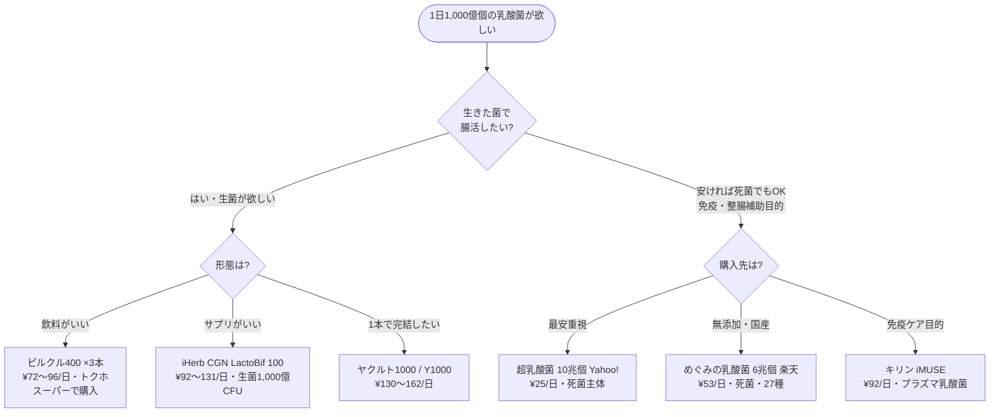

# 乳酸菌 1日1,000億個 コスパ最強商品 改訂版 v2（ファクトチェック反映）

**調査日:** 2026-06-04　**改訂:** 2026-06-04（v1の重大な誤りを訂正）
**追記:** 2026-06-04（生菌 vs 死菌の科学的エビデンス・有効用量・効果発現期間を論文ベースで追加 → 末尾「付録：科学的エビデンス」参照）
**調査チャネル:** Amazon / 楽天 / Yahoo!ショッピング / iHerb / スーパー・市販品（全5系統）

---

## 🔑 最重要ポイント（これだけは読んでほしい）

「乳酸菌1,000億個」には **まったく性質の異なる2種類** があります。比較の土俵が違うので、まずここを理解してください。

| | 生菌（CFU） | 死菌（殺菌菌体数） |
|---|---|---|
| **正体** | 生きて腸に届く乳酸菌 | 加熱殺菌された菌体（バイオジェニックス） |
| **表示単位** | CFU（生きて増殖できる菌だけ計測） | 「個数」（投入した菌体の数） |
| **主な目的** | 腸活・整腸（腸内環境を整える） | 免疫刺激・整腸補助・生菌のエサ |
| **代表例** | ヤクルト1000、ピルクル、iHerbサプリ | 「○兆個」系の国産サプリ全般、iMUSE |
| **価格傾向** | 高め | 安い（兆個でも数十円/日） |

> **⚠️ 「○兆個」と「○億個」は同じ尺度に見えますが別物です。**
> 国産の「5兆個」「10兆個」サプリの大半は**死菌**で、生きて腸に届く量ではありません。
> 「生きた乳酸菌を腸に届けたい（＝一般的な腸活）」なら、**生菌(CFU)** の商品を選ぶ必要があります。

---

## 🎯 結論：目的別ベストバイ

| あなたの目的 | おすすめ | 1日コスト | 理由 |
|---|---|---|---|
| **生きた乳酸菌で腸活（飲料）** | ピルクル400 ×3本 | **¥72〜96** | 生菌1,200億・トクホ・スーパーで買える |
| **生きた乳酸菌で腸活（サプリ）** | iHerb CGN LactoBif 100 | **¥92〜131** | 生菌1,000億CFU・26,559件・常温保存 |
| **手軽さ最優先（1本完結）** | ヤクルト1000／Y1000 | **¥130〜162** | 生菌1,000〜1,100億・1本でOK |
| **コスト最優先（死菌でOK）** | 超乳酸菌 10兆個（Yahoo!） | **¥25** | 全候補最安・ただし死菌 |

---

## 📊 ランキングA：生菌（CFU）— 生きた乳酸菌1,000億個以上

> 「生きて腸に届く乳酸菌」を1日1,000億個以上摂れる商品。一般的な腸活はこちら。

| 順位 | 商品 | チャネル | 生菌CFU/日 | 1日コスト | 信頼性 |
|---|---|---|---|---|---|
| **1** | ピルクル400 ×3本 | スーパー | 1,200億 | **¥72〜96** | トクホ・日清ヨーク |
| **2** | CGN LactoBif 100（セール時） | iHerb | 1,000億 | **¥92** | 26,559件・高評価 |
| **3** | ピルクルミラクルケア ×2本 | スーパー | 1,200億 | **¥94〜116** | 機能性表示食品 |
| **4** | ヤクルト1000 | 宅配専用 | 1,000億 | **¥130〜140** | シロタ株・臨床実績 |
| **5** | CGN LactoBif 100（通常価格） | iHerb | 1,000億 | **¥131** | 26,559件・常温可 |
| 6 | NOW Foods Probiotic-10 60粒 | Yahoo! | 1,000億 | ¥139 | ⚠️レビュー0件 |
| 7 | Y1000 | スーパー/コンビニ | 1,100億 | ¥150〜162 | シロタ株・店頭 |
| 8 | NOW Foods Probiotic-10 | iHerb | 1,000億 | ¥191 | 4.7／39,858件 |
| 9 | Renew Life 150 Billion | iHerb | 1,500億 | ¥308 | 40菌種・最高スペック |

### 生菌ランキングの推し詳細

**🥇 ピルクル400 ×3本（生菌で最安・¥72〜96/日）**
- 1本65mlに乳酸菌NY1301株 **400億個（生菌）**。3本で1,200億個
- **特定保健用食品（トクホ）** — 整腸効果が国に認められている
- スーパー・ドラッグストアで購入可（10本パック ¥235〜322 ＝ 1本¥24〜32）
- 留意：1日3本（195ml）飲む必要あり

**🥈 iHerb CGN LactoBif 100（サプリ生菌で最安・¥92〜131/日）**
- URL: https://jp.iherb.com/pr/california-gold-nutrition-lactobif-100-probiotics-100-billion-cfu-60-veggie-capsules/143854
- 1カプセルに **1,000億CFU（生菌）**・8菌種。60粒＝60日分
- 価格 $36.68（30%オフ時）〜$52.40。レビュー26,559件で信頼性高
- 常温保存可（フリーズドライ）。個人輸入のため到着まで5〜10日

**🥉 ピルクルミラクルケア ×2本（¥94〜116/日）**
- 1本に乳酸菌NY1301株 **600億個（生菌）**。2本で1,200億個
- 機能性表示食品（睡眠の質改善・疲労感軽減＋整腸）
- 8本パック ¥376〜463（1本¥47〜58）

---

## 📊 ランキングB：死菌（殺菌菌体数）— 安価・高個数

> 加熱殺菌された乳酸菌（バイオジェニックス）。生きてはいないが、免疫刺激・整腸補助・生菌のエサとしての報告あり。**圧倒的に安い**のが特徴。

| 順位 | 商品 | チャネル | 死菌個数/日 | 1日コスト | 注意点 |
|---|---|---|---|---|---|
| **1** | 超乳酸菌 10兆個 100g | Yahoo! | 約1,000億 | **¥25** | 死菌主体・全候補最安 |
| **2** | ビオリア 10兆個 EC-12 | 楽天 | 約3,333億 | **¥43** | 死菌主体＋酪酸菌1億は生菌 |
| 3 | Amazon 5兆個×32種 | Amazon | 5兆 | ¥44 | 死菌・**⚠️サクラ警告寄り** |
| 4 | LACT 5兆個 | 楽天 | 約1,667億 | ¥53 | 死菌（商品ページ明記） |
| 4 | めぐみの乳酸菌 6兆個 | 楽天 | 約2,000億 | ¥53 | 死菌明記・27種・無添加 |
| 6 | AFC 1日1兆個ナノ型 | Yahoo!/楽天 | 1兆 | ¥108 | 死菌・機能性表示食品 |
| 7 | キリン iMUSE 免疫ケア | 薬局・ネット | 1,000億 | ¥92 | 死菌・**免疫特化（腸活非対象）** |

### 死菌ランキングの推し詳細

**🥇 超乳酸菌 10兆個 100g（全候補最安・¥25/日）**
- URL: https://store.shopping.yahoo.co.jp/supplemarche/nyusan-ultra.html
- 100g粉末（100日分）¥2,500・送料無料。1日1gで約1,000億個
- EC-12（殺菌乳酸菌）等の**死菌主体**。レビュー★4.39／61件
- 「とにかく安く菌体数を摂りたい」人向け

**🥈 ビオリア 10兆個 EC-12（楽天・¥43/日）**
- URL: https://item.rakuten.co.jp/stars-store/10000209/
- ¥1,280・30日分。EC-12は**加熱殺菌乳酸菌（死菌）**。別途生きた酪酸菌1億個を配合
- ★4.2／705件（※楽天レビューは投稿特典バイアスに留意）

**⚠️ Amazon 5兆個×32種（B0CQ2ZB8BG・¥44/日）— v1から評価下方修正**
- URL: https://www.amazon.co.jp/dp/B0CQ2ZB8BG
- 主原料nanoECF®は**加熱殺菌の死菌**。5兆個は死菌の菌体数で生菌CFUではない
- **サクラチェッカー再判定：「Amazonよりかなり低いスコア」＝警告寄り**（v1の「✅合格」は誤り）
- 評価3.9と低めなのは「生きて届く」効果を期待した層の体感差レビューが一因

**キリン iMUSE 免疫ケア（¥92/日）— v1から大幅訂正**
- 1日4粒にプラズマ乳酸菌1,000億個。**死菌（DNAが免疫細胞pDCに作用）**
- 実売 税込約¥2,767／30日 ＝ **1日約¥92**（v1の「¥33」は誤価格¥992に基づく誤り）
- **免疫ケア専用**で、腸内環境改善（腸活）は訴求対象外。「乳酸菌を腸に届ける」目的とは別物

---

## 🗺️ 選び方フローチャート

---

## ⚠️ v1からの訂正一覧（ファクトチェック結果）

| # | 項目 | v1（誤） | v2（正） | 根拠 |
|---|---|---|---|---|
| 1 | iMUSE 価格 | ¥992／1日¥33 | 実売¥2,767／**1日¥92** | 価格.com・キリン公式 |
| 2 | iMUSE 菌の種類 | 生菌扱い | **死菌（ポストバイオティクス）** | キリン公式研究コラム |
| 3 | iMUSE 目的 | 腸活候補1位 | **免疫ケア専用**（腸活非対象） | imuse-p.jp |
| 4 | Amazon 5兆個 菌種 | 生菌50,000億CFU | **死菌（菌体数）** | Broma/BALBAL原料公式 |
| 5 | Amazon 5兆個 サクラ | ✅合格 | **警告寄り（かなり低い）** | サクラチェッカー再判定 |
| 6 | ビオリア/LACT/めぐみ | 生菌CFU扱い | **全て死菌** | 各商品ページ・EC-12原料公式 |
| 7 | 野口善玉菌 | 生菌1,000億・サクラ合格4.5 | **生死不明・サクラ警告寄り** | サクラチェッカー再判定 |
| 8 | ピルクル400 区分 | トクホ/機能性表示で揺れ | **トクホで確定** | pilkul.jp |
| 9 | Y1000 仕様 | 1,000億個 | **110ml・1,100億個** | ヤクルト公式 |

---

## 💡 賢い選び方のヒント

1. **目的で選ぶ** — 腸活なら生菌(CFU)、コスト最優先・免疫ケアなら死菌。菌数の大小だけで優劣を決めない。
2. **「○兆個」に惑わされない** — 大半が死菌の菌体数。生菌1,000億CFUの方が「兆個」死菌より腸活には適する場合がある。
3. **菌株を見る** — シロタ株（ヤクルト）・NY1301株（ピルクル）は生きて腸に届く臨床実績のある生菌。
4. **明治R-1は別カテゴリ** — 菌数非公表（推定約1億個程度）。1,000億個摂取目的には不向き。価値はEPS（多糖体）による免疫サポート。
5. **価格・在庫は変動** — 特にAmazon/楽天/iHerbはセール・在庫変動が大きい。購入直前に再確認を。

---

## 全候補・統合比較表（生菌/死菌・1日コスト順）

| 商品 | 種別 | 菌数/日 | 1日コスト | チャネル | 信頼性メモ |
|---|---|---|---|---|---|
| 超乳酸菌 10兆個 | 死菌 | 約1,000億 | ¥25 | Yahoo! | ★4.39/61件 |
| ビオリア 10兆個 | 死菌主体 | 約3,333億 | ¥43 | 楽天 | ★4.2/705件 |
| Amazon 5兆個×32種 | 死菌 | 5兆 | ¥44 | Amazon | ⚠️サクラ警告寄り |
| LACT 5兆個 | 死菌 | 約1,667億 | ¥53 | 楽天 | ★4.64/250件 |
| めぐみの乳酸菌 6兆個 | 死菌 | 約2,000億 | ¥53 | 楽天 | ★4.29/174件・無添加 |
| **ピルクル400 ×3本** | **生菌** | 1,200億 | ¥72〜96 | スーパー | トクホ |
| iMUSE 免疫ケア | 死菌 | 1,000億 | ¥92 | 薬局 | 免疫特化 |
| **CGN LactoBif 100（セール）** | **生菌** | 1,000億 | ¥92 | iHerb | 26,559件 |
| **ピルクルミラクルケア ×2本** | **生菌** | 1,200億 | ¥94〜116 | スーパー | 機能性表示 |
| AFC 1日1兆個ナノ型 | 死菌 | 1兆 | ¥108 | Yahoo!/楽天 | 機能性表示 |
| **CGN LactoBif 100（通常）** | **生菌** | 1,000億 | ¥131 | iHerb | 26,559件 |
| **ヤクルト1000** | **生菌** | 1,000億 | ¥130〜140 | 宅配 | シロタ株 |
| NOW Probiotic-10 60粒 | 生菌 | 1,000億 | ¥139 | Yahoo! | ⚠️レビュー0件 |
| **Y1000** | **生菌** | 1,100億 | ¥150〜162 | スーパー | シロタ株 |
| NOW Probiotic-10 | 生菌 | 1,000億 | ¥191 | iHerb | 4.7/39,858件 |
| Renew Life 150B | 生菌 | 1,500億 | ¥308 | iHerb | 40菌種 |

---

---

# 📚 付録：科学的エビデンス（生菌 vs 死菌）

> PubMed掲載のRCT・メタ解析・システマティックレビューを論文ベースで調査（2015年以降重視・2020年以降を重点）。各主張は3票方式で敵対的検証済み。
> **免責：** 本付録は学術情報の要約であり、医療アドバイスではありません。基礎疾患のある方・妊娠中・免疫不全の方は医師に相談してください。

## TL;DR（科学的結論の要点）

1. **「生菌が常に優れる」わけではない。** 効果は「生死（viability）」より **菌株と用量** に依存する（IBD動物メタ解析43本でP>.05・生死で有意差なし）。
2. **死菌で十分／むしろ優れる領域**：免疫調節・腸管バリア強化・抗炎症・アレルギー・酸化ストレス軽減。
3. **生菌でなければ実現できない領域**：短鎖脂肪酸(SCFA)産生・腸内細菌叢の多様性改善・代謝調節。**＝「本来の腸活」は生菌が必要。**
4. **有効用量**：生菌は **1日10億〜1,000億CFU（10⁹〜10¹¹）**、死菌は **1日約1,000億個（10¹¹）前後** が標準域。「多いほど良い」ではない（IBSは過剰投与で無効化）。
5. **効果発現**：消化器症状は **1〜2週間**、本格的な腸内環境・IBS改善は **2〜3ヶ月**。**中断すると効果は元に戻る**（継続が前提）。
6. **安全性**：健常者は両者とも安全。ただし **生菌は免疫不全・未熟児・重症膵炎で重篤リスク**（菌血症・死亡例）。**死菌はこのリスクが理論的に存在せず明確に安全。**

---

## 1. 効果量・エビデンス強度の比較

### 1-A. 生菌 vs 死菌の直接比較（効果量）

| 試験 | モデル | 結果（効果量） | 優劣 |
|---|---|---|---|
| Poaty Ditengou 2023（**J Appl Microbiol**・動物メタ解析43本） | DSS腸炎 | 結腸長SMD +2.43／疾患活動性SMD −4.36／組織SMD −3.96 | **生死で有意差なし（P>.05）** |
| Koh 2024（**ACS Omega**） | DSS腸炎 | DAI −21%・組織スコア改善・Treg誘導 | **生菌が優位**（SCFA→GPR43経由） |
| Kang 2025（**J Microbiol Biotechnol**） | DSS腸炎 | タイトジャンクション遺伝子 ZO-1 2.73倍・OCLN 3.81倍 | **死菌が優位**（腸管バリア） |
| Rezaie 2024（**Sci Rep**） | 高脂肪食+腸炎 | 抗酸化酵素回復・TNF-α低下（p<0.0001） | **死菌/ポストが優位**（Nrf2経路） |
| Sugahara 2017（**Benef Microbes**） | ノトバイオート | 免疫調節＝同等／代謝調節＝生菌のみ | 用途で分岐 |

**結論：** 効果量は菌株・用途で大きく変動。免疫・バリア・抗炎症は死菌が同等以上、代謝・菌叢改変は生菌が必須。

### 1-B. 生菌の腸活エビデンス強度（ヒトRCT・メタ解析）

| 研究 | デザイン | 適応 | 効果量 |
|---|---|---|---|
| IBSメタ解析 2023（72 RCT・PMC10651259） | SR+MA | IBS | 全般症状SMD −0.55／腹痛SMD −0.89／QOL +0.99 |
| Zeng 2025（**Eur J Med Res**・15メタ解析） | アンブレラ | GI全般 | 下痢リスク56%減（RR 0.44） |
| Garzon 2024（**Cureus**・10 RCT 1,243名） | SR+MA | 慢性便秘 | OR 2.37（p<0.01）・70%改善 |
| Zheng 2023（**Front Immunol**・26 RCT） | MA | 腸管バリア | zonulin・LPS・CRP・IL-6 有意低下 |
| Éliás 2026（**BMC Medicine**・47 RCT） | SR+MA | 健常者 | **菌叢多様性に有意な効果なし** ⚠️ |

> ⚠️ **重要：** 「健常者が腸内多様性を上げる目的」では47 RCTのメタ解析でも有意差が出ていない。プロバイオティクスは「症状のある人の改善」のエビデンスが厚く、「健康な人がさらに健康になる」エビデンスは弱い。

### 1-C. 死菌（パラ/ポストバイオティクス）のヒトエビデンス

- **プラズマ乳酸菌（L. lactis Plasma）**：デング熱様症状抑制RCT（PMC8707015）、皮膚常在菌・スキン改善RCT（PMC8000884）。免疫（pDC活性化）特化。
- **EC-12（殺菌 E. faecalis）**：学業ストレス下の学生で消化器不快感を有意改善（1週間投与・PubMed 39481416）。
- **熱処理 L. casei 327**：健常者の排便改善RCT（PMC6081609）。
- **国際定義**：ISAPP 2021（**Nat Rev Gastroenterol Hepatol**）がポストバイオティクスを正式定義し「生存性と独立した機能」を承認。ただし大規模・長期のヒト臨床データは生菌より少なく蓄積段階。

---

## 2. 有効用量（1日あたり何億個必要か）

### 生菌（CFU）— 標準有効域：1日 10億〜1,000億 CFU（10⁹〜10¹¹）

| 目的 | 有効用量 | 出典 |
|---|---|---|
| IBS（過敏性腸症候群） | **10億〜100億CFU**（10⁹〜10¹⁰） | Liang 2019・14 RCT。**100億超はむしろ有意差なし** |
| 抗菌薬関連下痢（AAD） | **100億CFU以上**（≥10¹⁰）、LGGで明確な用量依存 | Szajewska 2015・12 RCT |
| 機能性便秘 | **150億CFU**（1.5×10¹⁰）の複合製剤で1週間以内に改善 | RCT |
| IBD（重症消化器疾患） | **1,000億〜10兆CFU**（10¹⁰〜10¹²）が参考域 | Zhang 2021・38 RCT |
| BB-12（便中回収） | 10億→1,000億で回収率が線形増加 | Larsen 2006・用量反応試験 |

### 死菌（殺菌菌体数）— 標準域：1日 約1,000億個（10¹¹）前後

| 素材 | 使用量 | 用途 |
|---|---|---|
| プラズマ乳酸菌（LC-Plasma） | **約1,000億個/日**（1×10¹¹） | 免疫ケア（市販iMUSEと同等） |
| EC-12 | カプセルで数十〜数百mg/日（菌体数換算で数百億〜兆個） | 整腸・消化器不快感 |
| ナノ型乳酸菌nEF（AFC） | **1兆個/日** | 機能性表示（便通） |

### 用量依存性のまとめ（重要）

- **用量依存あり**：AAD予防（LGG）・血圧降下（>10¹¹）・BB-12便中回収
- **用量依存なし／逆効果**：**IBS（10¹⁰超で無効化）**・C.difficile・健常者の菌叢多様性
- **結論：「高用量＝高効果」ではない。** 菌株特異的・疾患特異的。1,000億個は多くの目的で十分量に達しており、それ以上の「兆個」は腸活目的では追加メリットが乏しい場合がある。

---

## 3. 効果発現までの期間

| フェーズ | 期間 | 内容 |
|---|---|---|
| 即時〜数日 | 1〜3日 | 軽い消化（お腹の動き）の体感変化が出ることがある |
| 短期 | **1〜2週間** | 膨満感・ガス・便通の改善が観察され始める（多くのRCTの最短評価点） |
| 中期 | **2〜3ヶ月** | IBS・本格的な腸内環境改善はこの期間が推奨（IBSメタ解析） |
| 臨床試験標準 | 3〜12週（8〜12週に集中） | 大半の試験デザインの観察期間 |
| 中断後（washout） | 数日〜数週で復帰 | **効果は永続しない。腸内細菌叢は元に戻り、継続摂取が必要** |

- **死菌の免疫応答**：プラズマ乳酸菌等は数週間（4〜8週）の継続でpDC活性・症状指標の変化が報告される。
- **生菌は腸に「定住」しない**：摂取をやめると数日〜数週で検出されなくなる（一過性通過菌）。だからこそ毎日の継続が前提。

> 💡 **実践的示唆：** 「最低2週間は続けて様子を見る／本命の判断は2〜3ヶ月」。1〜2週間で効果ゼロでも見切りが早すぎる場合がある。一方、数ヶ月続けても無反応なら菌株を変える。

---

## 4. 安全性プロファイル

### リスク・マトリクス

| 集団 | 生菌（プロバイオティクス） | 死菌（パラ/ポスト） |
|---|---|---|
| 健常成人 | 低（一過性の膨満・ガス） | **極低（感染リスクなし）** |
| 高齢者（基礎疾患あり） | 中〜高 | 低 |
| 未熟児・NICU | **高（FDA 2023警告）** | 低（理論上安全・臨床データ限定） |
| 免疫不全（がん/移植/HIV等） | **高（菌血症・死亡例）** | **低（感染が理論的に起こり得ない）** |
| 重症急性膵炎 | **極高（禁忌・死亡RR 2.53）** | データ不足 |
| 中心静脈カテーテル留置 | 高（血中移行リスク） | 低 |

### エビデンス要点

- **健常者**：有害事象は介入群と対照群で差なし（Hempel 2011・RR 1.00）。主症状は一過性の消化器症状。
- **免疫不全での菌血症**：プロバイオティクス使用者の侵襲性感染リスクは非使用者の **127倍**（Oregon症例対照・絶対リスクは約0.3%と低いが重篤）。原因菌の最多は **L. rhamnosus GG**。
- **重症急性膵炎**：PROPATRIA試験（**The Lancet** 2008）で死亡率がプラセボ6%→プロバイオティクス16%（**RR 2.53**）。**禁忌**。
- **未熟児**：FDAが2023年に致死的感染リスクを医療者へ明示警告。
- **死菌の安全性優位**：生存菌でないため血流内で増殖・感染できず、抗菌薬耐性遺伝子の水平伝播も起こらない。免疫不全者・未熟児にとって理論的に安全。抗菌薬併用も可。

---

## 5. 総合判断：あなたはどちらを選ぶべきか

| あなたの状況・目的 | 推奨 | 理由 |
|---|---|---|
| 便秘・下痢・IBS・腸内環境を整えたい（腸活本来の目的） | **生菌（CFU）** | SCFA産生・菌叢改善は生菌のみ。1日10⁹〜10¹¹ CFU・2〜3ヶ月継続 |
| 免疫ケア・風邪/アレルギー対策が主目的 | **死菌でも十分**（プラズマ乳酸菌等） | 免疫調節は生死同等。安価で安定 |
| 免疫不全・抗がん剤治療中・高齢で基礎疾患多数・未熟児 | **死菌を選ぶ（生菌は要医師相談）** | 生菌は菌血症リスク。死菌は感染リスクなし |
| とにかく安く菌体数を摂りたい・整腸の補助でOK | **死菌（安価）** | 兆個でも¥25〜53/日。ただし「生きて届く」効果は期待しない |
| 抗菌薬を服用中 | **死菌** | 生菌は抗菌薬で失活。死菌は影響を受けない |

---

## 6. 主要引用論文

**有効用量・腸活エビデンス（生菌）**
- Liang D 2019, *Medicine*, IBSネットワークメタ解析: [PMC6635271](https://pmc.ncbi.nlm.nih.gov/articles/PMC6635271/)
- Zhang XF 2021, *Eur J Nutr*, IBD 38 RCT: [PubMed 33555375](https://pubmed.ncbi.nlm.nih.gov/33555375/)
- Garzon 2024, *Cureus*, 便秘 10 RCT: [PMC10854359](https://pmc.ncbi.nlm.nih.gov/articles/PMC10854359/)
- Zeng Q 2025, *Eur J Med Res*, アンブレラ解析: [PMC12183855](https://pmc.ncbi.nlm.nih.gov/articles/PMC12183855/)
- Éliás 2026, *BMC Medicine*, 健常者47 RCT: [PMC12870995](https://pmc.ncbi.nlm.nih.gov/articles/PMC12870995/)
- Ouwehand 2017, *Benef Microbes*, 用量反応レビュー: [PubMed 28008787](https://pubmed.ncbi.nlm.nih.gov/28008787/)
- Larsen 2006, *Eur J Clin Nutr*, BB-12用量反応: [PubMed 16721394](https://pubmed.ncbi.nlm.nih.gov/16721394/)

**生菌 vs 死菌 直接比較**
- Poaty Ditengou 2023, *J Appl Microbiol*, 動物メタ解析43本: [DOI 10.1093/jambio/lxad008](https://academic.oup.com/jambio/article/134/3/lxad008/6988181)
- Koh 2024, *ACS Omega*, B. coagulans BC198: [DOI 10.1021/acsomega.3c07529](https://pubs.acs.org/doi/10.1021/acsomega.3c07529)
- Kang 2025, *J Microbiol Biotechnol*, パラvs生菌: [PMC11896797](https://pmc.ncbi.nlm.nih.gov/articles/PMC11896797/)
- Rezaie 2024, *Sci Rep*, ポストvs生菌: [PMC11109304](https://www.ncbi.nlm.nih.gov/pmc/articles/PMC11109304/)
- Sugahara 2017, *Benef Microbes*, B. breve 生死比較: [PubMed 28441886](https://pubmed.ncbi.nlm.nih.gov/28441886/)
- Salminen 2021（ISAPP）, *Nat Rev Gastroenterol Hepatol*, ポストバイオ定義: [DOI 10.1038/s41575-021-00440-6](https://www.nature.com/articles/s41575-021-00440-6)

**死菌の有効用量・臨床**
- プラズマ乳酸菌 デング熱抑制RCT: [PMC8707015](https://www.ncbi.nlm.nih.gov/pmc/articles/PMC8707015/)
- EC-12 学業ストレス下の整腸RCT: [PubMed 39481416](https://pubmed.ncbi.nlm.nih.gov/39481416/)
- 熱処理 L. casei 327 排便改善RCT: [PMC6081609](https://www.ncbi.nlm.nih.gov/pmc/articles/PMC6081609/)

**安全性**
- Merenstein 2023, *Gut Microbes*, 安全性レビュー: [PMC10026873](https://pmc.ncbi.nlm.nih.gov/articles/PMC10026873/)
- Besselink 2008, *The Lancet*, PROPATRIA（膵炎禁忌）: [DOI 10.1016/S0140-6736(08)60207-X](https://www.thelancet.com/journals/lancet/article/PIIS014067360860207X/abstract)
- Oregon OHSU 2022, 症例対照（感染127倍）: [PMC9588441](https://pmc.ncbi.nlm.nih.gov/articles/PMC9588441/)
- NCCIH, Probiotics Usefulness and Safety: [nccih.nih.gov](https://www.nccih.nih.gov/health/probiotics-usefulness-and-safety)

**効果発現期間**
- IBSメタ解析72 RCT（2〜3ヶ月推奨）: [PMC10651259](https://www.ncbi.nlm.nih.gov/pmc/articles/PMC10651259/)

---

## 調査メタ情報

| 項目 | 内容 |
|---|---|
| 調査日 | 2026-06-04 |
| チャネル | Amazon / 楽天 / Yahoo! / iHerb / スーパー市販品（全5系統） |
| ファクトチェック | 市販飲料・ECサプリの菌数/価格/生死/サクラを一次情報で再検証 |
| 検証で訂正した項目 | 9件（上記訂正一覧） |
| 価格・在庫 | 2026-06-04時点。変動するため購入直前に再確認推奨 |
| iHerb換算 | 1 USD = 150円 |

---

## 主な出典

- キリン iMUSE 公式: https://www.imuse-p.jp/plasma/about/ ／ 価格.com: https://kakaku.com/item/K0001614302/
- ピルクル400（トクホ）公式: https://www.pilkul.jp/pilkul400/ ／ ミラクルケア: https://www.pilkul.jp/miraclecare/
- ヤクルト1000公式: https://www.yakult.co.jp/products/item0345.html ／ Y1000: https://www.yakult.co.jp/products/item0379.html
- コンビ EC-12（殺菌乳酸菌）公式: https://www.combi.co.jp/f-foods/products/ec-12/index.html
- Broma nanoECF（死菌原料）公式: https://www.broma.co.jp/nano_ecf/
- サクラチェッカー B0CQ2ZB8BG: https://sakura-checker.jp/search/B0CQ2ZB8BG/
- iHerb CGN LactoBif 100: https://jp.iherb.com/pr/california-gold-nutrition-lactobif-100-probiotics-100-billion-cfu-60-veggie-capsules/143854

---

## GitHub リンク

1. **本レポート（v2）:** [reports/search_20260604_lactobacillus_1000billion_final-v2.md](https://github.com/KazuyaMurayama/shopping_product_search/blob/main/reports/search_20260604_lactobacillus_1000billion_final-v2.md)
2. **v1（参考・誤り含む）:** [reports/search_20260604_lactobacillus_1000billion_final.md](https://github.com/KazuyaMurayama/shopping_product_search/blob/main/reports/search_20260604_lactobacillus_1000billion_final.md)
3. **レポート履歴:** [reports/index.txt](https://github.com/KazuyaMurayama/shopping_product_search/blob/main/reports/index.txt)
